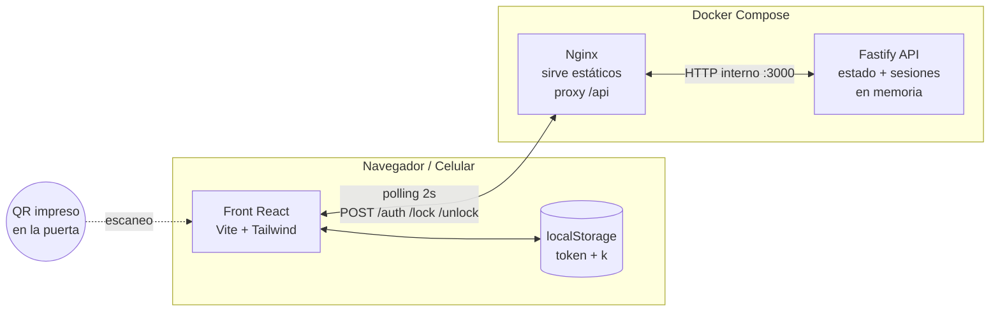
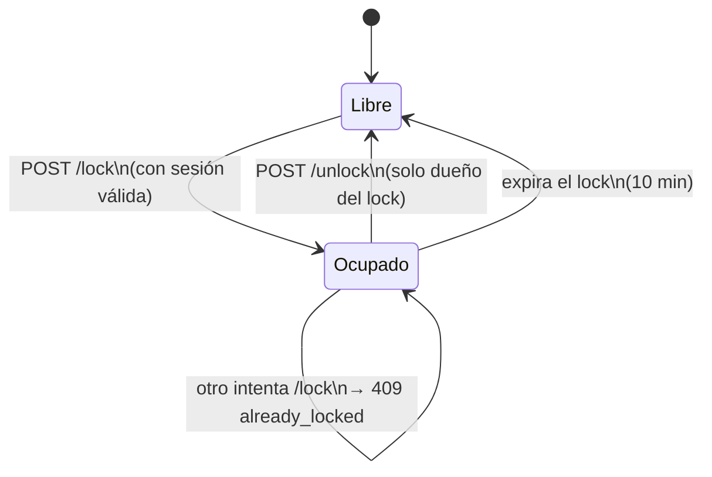
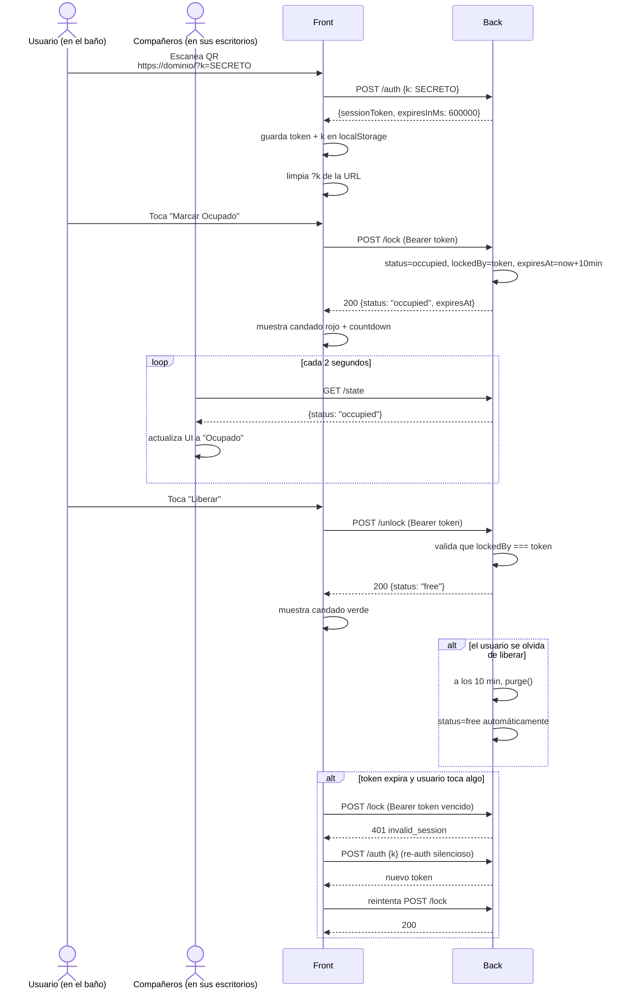

# Baño Office

App web minimal para saber si el único baño de la oficina está libre u ocupado, sin sensores ni hardware. Solo un QR impreso en la puerta.

- **Front**: React + Vite + TypeScript + Tailwind + react-icons. Mobile-first, una sola pantalla.
- **Back**: Node.js + Fastify + TypeScript. Estado en memoria, sin base de datos.
- **Control de acceso**: QR estático con secreto (`?k=...`) que se canjea por una sesión de 10 min.
- **Lock distribuido**: el primero en tocar "Ocupar" obtiene el control; solo ese token puede liberar.

---

## Arquitectura



Sin base de datos a propósito: el estado es un único objeto global. Si el contenedor se reinicia, arranca "Libre" en menos de 1 segundo. Para un baño de oficina es un tradeoff aceptable.

## Modelo de control de acceso

El QR **no identifica personas**. Es una "llave física" que, al usarse, emite una sesión temporal. Como está impreso en la puerta del baño, para abusar del estado alguien tendría que caminar hasta el baño y escanearlo.



## Flujo completo de uso



## Variables de entorno

| Variable         | Dónde   | Default | Descripción                                              |
|------------------|---------|---------|----------------------------------------------------------|
| `BANO_QR_KEY`    | back    | random  | Secreto del QR. **Generalo una sola vez y NO lo cambies.** |
| `CORS_ORIGIN`    | back    | `*`     | Origen permitido (tu dominio). Default `*` (cualquiera). |
| `FRONT_PORT`     | compose | `8080`  | Puerto del front en el host.                            |
| `LOCK_DURATION_MS`    | back | `600000`  | Duración del lock en ms (10 min).                |
| `SESSION_DURATION_MS` | back | `600000`  | Duración de la sesión en ms (10 min).            |

## Qué cambiar en producción (y cómo generar el QR)

**Obligatorio:**

1. **Generá un `BANO_QR_KEY` nuevo** (NO uses el del `.env.example` ni el de test):
   ```bash
   node -e "console.log(require('crypto').randomUUID())"
   ```
   Ejemplo de salida: `a3f5e1b2-4c8d-4a2f-9e6b-1d7c3f5a8b9e`

2. **Configuralo en Dokploy** como variable de entorno del servicio:
   ```
   BANO_QR_KEY=a3f5e1b2-4c8d-4a2f-9e6b-1d7c3f5a8b9e
   ```

3. **Construí el link del QR** con TU dominio real y TU clave:
   ```
   https://bano.tu-empresa.com/?k=a3f5e1b2-4c8d-4a2f-9e6b-1d7c3f5a8b9e
   ```

4. **Generá la imagen QR** con ese link exacto:
   - Online: cualquier generador (qrcode-monkey.com, qr-code-generator.com)
   - Consola: `qrencode -t PNG -o bano-qr.png -s 10 "https://bano.tu-empresa.com/?k=..."`
   - Imprimir en tamaño claro (mínimo 8x8 cm), plastificar y pegar en la puerta del baño.

5. **`CORS_ORIGIN`**: cambialo a tu dominio por seguridad:
   ```
   CORS_ORIGIN=https://bano.tu-empresa.com
   ```

**Opcional:**
- `FRONT_PORT`: si Dokploy/Traefik mapea a otro puerto.
- `LOCK_DURATION_MS` / `SESSION_DURATION_MS`: solo si querés lock más corto/largo.

**Regla de oro:** si cambiás `BANO_QR_KEY` después de imprimir el QR, **el QR impreso deja de funcionar** y hay que reimprimirlo.

## Uso local con Docker

```bash
cp .env.example .env
# generá un UUID para BANO_QR_KEY y editá .env:
node -e "console.log(require('crypto').randomUUID())"
docker compose up --build
```

- Estado en solo lectura: http://localhost:8080
- Con permisos (simula el QR): http://localhost:8080/?k=TU_BANO_QR_KEY

## Desarrollo sin Docker

```bash
# Back
cd back && npm install && npm run dev    # http://localhost:3000

# Front (en otra terminal)
cd front && npm install && npm run dev   # http://localhost:5173 (proxy /api -> :3000)
```

## API

| Método | Ruta      | Auth             | Body                | Respuestas                                      |
|--------|-----------|------------------|---------------------|-------------------------------------------------|
| GET    | `/health` | -                | -                   | `200` healthcheck                               |
| GET    | `/state`  | -                | -                   | `200` estado público                            |
| POST   | `/auth`   | -                | `{k}`               | `200` `{sessionToken, expiresInMs}` / `401`    |
| POST   | `/lock`   | `Bearer` session | -                   | `200` ocupado / `401` sesión / `409` ya ocupado |
| POST   | `/unlock` | `Bearer` session | -                   | `200` libre / `401` sesión / `403` no dueño     |
| GET    | `/me`     | `Bearer` session | -                   | `200` `{authenticated: bool}`                   |

## Estructura del proyecto

```
Baño/
├── docker-compose.yml
├── .env.example
├── README.md
├── back/
│   ├── src/
│   │   ├── server.ts        # Fastify + parser tolerante + healthcheck
│   │   ├── state.ts         # Estado en memoria, sesiones, lock con expiry
│   │   ├── routes.ts        # /auth /lock /unlock /state /me /health
│   │   └── config.ts        # Variables de entorno
│   └── Dockerfile
└── front/
    ├── src/
    │   ├── App.tsx          # UI principal (estados, switch, iconos)
    │   ├── api.ts           # Cliente HTTP + persistencia localStorage
    │   ├── useBanoState.ts  # Hook con polling, auth y re-auth silencioso
    │   └── main.tsx
    ├── nginx.conf           # Sirve estáticos + proxy /api -> back:3000
    └── Dockerfile
```

## Decisiones de diseño

- **Sin DB**: el estado es un único objeto. Reinicio = arranca libre. Tradeoff aceptable para 1 baño.
- **Sin WebSocket**: polling cada 2 s. Para 5-15 personas es más simple y suficiente.
- **QR como secreto físico**: cualquier URL conocida sin `?k` solo muestra estado en solo lectura.
- **Lock por tiempo, no por presencia**: si alguien olvida liberar, expira solo. Antipatrón de "baño ocupado para siempre".
- **Re-auth silencioso**: si el token expira mientras la pestaña está abierta y el `k` sigue en `localStorage`, se renueva solo sin pedir re-escanear.
